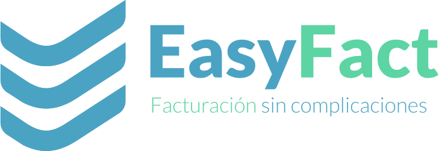
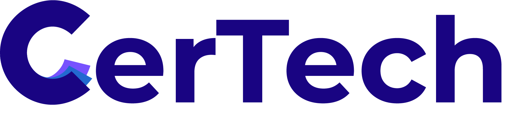
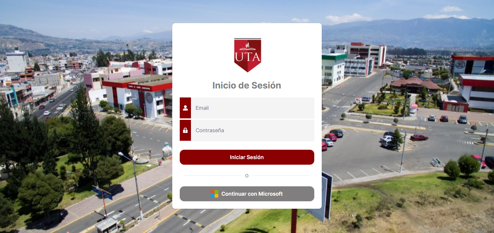

<!-- 
<h2>Hey there! I'm José Ojeda</h2> -->

# 👋 &nbsp;Hey there! I'm José Ojeda

## 👨🏻‍💻 &nbsp;About Me

Throughout my university career, I have actively participated in the execution and collaboration in multiple projects, which has contributed significantly to my professional development. During this time, I have had the opportunity to immerse myself in a wide range of tools and technologies, which has strengthened my skills and knowledge comprehensively. This experience has allowed me to acquire a solid foundation in problem solving and implementing innovative solutions in collaborative environments.

💡 &nbsp;I like to explore new technologies and develop software solutions.\
🎓 &nbsp;I Software Engineer from the Technical University of Ambato.\
🌱 &nbsp;I'm on my way to learning more about Security and Cloud Architecture.\
✍️ &nbsp;In my free time I dedicate myself to sports and watching movies as hobbies and secondary activities.\
💬 &nbsp;Don't hesitate to contact me to work on a project.\
📄 &nbsp;Please have a look at my [Résumé](https://1drv.ms/b/s!AlybSi_bVGVMgqYEiHfeMmVOQzkheA?e=oCN0M3) for more details about me. I'm open to feedback and suggestions!

## 🛠 &nbsp;Tech Stack

### 💻 &nbsp;Frameworks

  

### 🚀 &nbsp;Programming Languages

  

### 📝 &nbsp; IDE

  

### 📂 &nbsp;Control Version

  

### 🛢️ &nbsp;Database

  

### 🧩 &nbsp;ORM

  

### ☁ &nbsp;Cloud

  

## 🌟 &nbsp;Featured Projects
<table>
<tr>
<td width="50%">
  <h3 align="center">Mobile application for electronic billing (BackEnd)</h3>
  

    
    

      
    

    
Developing a <strong>Mobile application for electronic billing BackEnd</strong> - This project involves the creation of an API for a mobile electronic invoicing application. Includes functionalities and sending of emails as indicated by the SRI.

  
                
</td>

<td width="50%">
   
  <h3 align="center">Web application for Certificate Management (BackEnd)</h3>
  

    
     
    

      
    

    
Developing a <strong>Web application for Certificate Management BackEnd</strong> - This project consists of the creation of an API for a web application for the generation and administration of certificates. Includes functionalities to validate the document.

  
   
</td> 
</table>   
<table>
<tr>
<td width="50%">
  <h3 align="center">Web application to simulate credits and investments</h3>
  

    
    

      
    

    
Developing a <strong>Web application to simulate credits and investments</strong> - This credit and investment simulation project has revolutionized the process, offering clients of a banking entity an efficient and accurate way to price their financial options.

  
                
</td>

<td width="50%">
   
  <h3 align="center">Web application to store and manage files</h3>
  

    
     
    

      
    

    
Developing a <strong>Web application to store and manage files</strong> - This project consists of the creation of a cloud to store the documents of the students of the Technical University of Ambato.

  
   
</td> 
</table>   

## 📊 &nbsp;GitHub Analytics

<a href="https://github.com/jojeda5171">
  
  <!-- 
   -->
</a>

